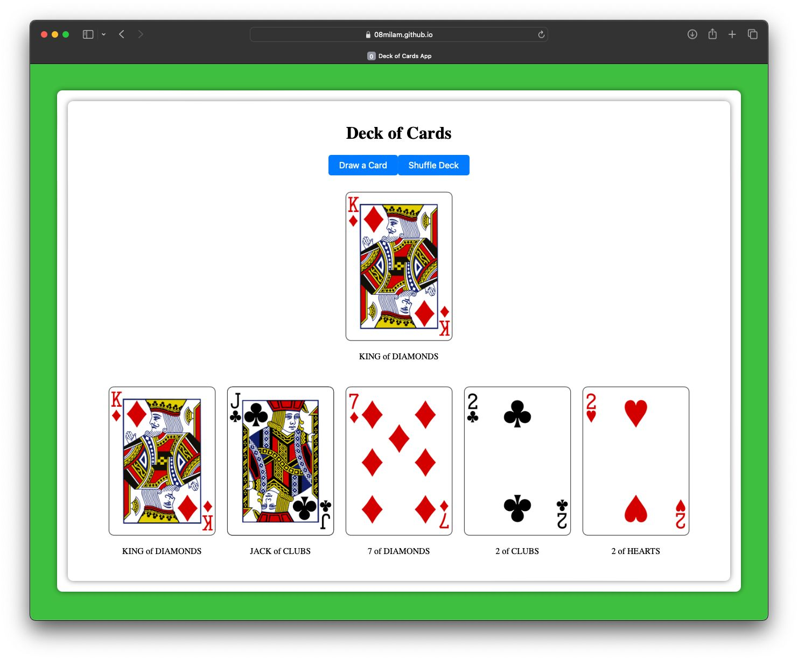

Embark on a journey through the world of cards with the Deck of Cards app! This simple yet captivating application, powered by React.js, CSS, JavaScript, and HTML, lets you delve into the realm of playing cards. Explore a virtual deck filled with endless possibilities, from standard suits to unique designs. With smooth animations and intuitive controls, you can shuffle, deal, and explore the cards at your leisure. Whether you're a seasoned card enthusiast or simply curious, the Deck of Cards app offers a delightful experience for all.

HOW TO RUN 
------------------------------------
* To get started, navigate to the Pokercards repository on GitHub and download the files. Then, open the folder in Visual Studio Code and launch the live server extension. This action  will automatically open the project in your default web browser.

TECHNOLOGY STACK USED
------------------------------------
* HTML
* CSS
* JavaScript
* reactDOM

